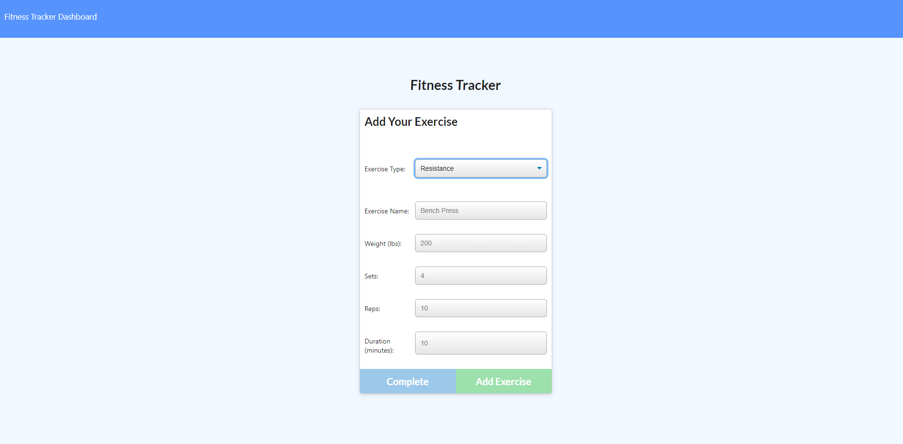

# Fitness Tracker App

## Initial setup for local usage (installing npm packages):

In gitbash, run command npm install, and all node modules should be installed to your local instance.

## User story:

AS A USER,
I want to be able to track all of my workouts, and have them saved to a database for future referencing, so I can add new workouts, and see a breakdown of all the activities I have been doing.

## Method:

Using api and html routes, we are able to move throughout the app, and connect to our database. Using models, we declare the workout schema and specific data the array will contain. Finally, using our api, exercise, index, stats, and exercise.js files, we target items on the html, create variables and arrays for our data, and then use that data to append to our pages.  

## Demonstration:

### -Main page

### -Creating a workout

### -Reviewing workouts

## Technologies Used:

API routes

MongoDB for local databasing

HTML routes

Mongo Atlas for Heroku

Heroku

Github

## Deployed Heroku link:

https://unit17-fitness-tracker.herokuapp.com/